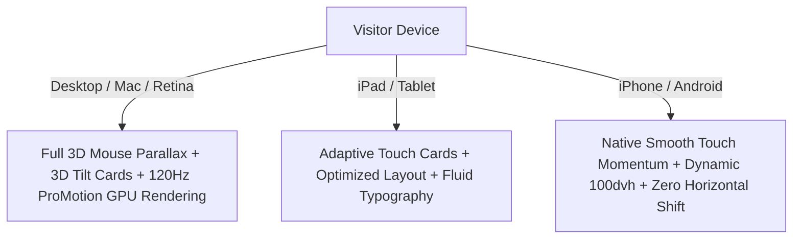

# VeloSynq Next-Gen Website: Complete Design, Product & Architecture Specification

## 1. Live Website Inventory (`https://velosynq.com`)

### Exact Core Products & Offerings Preserved:
The new website directly retains and elevates the complete product & service lineup from the live site:

| Product / Service | Category / Focus | Key Capabilities & Tags | Competitor Alternative |
| :--- | :--- | :--- | :--- |
| **01. SprintSynq** | Agile Project Management | Sprint Planning, Kanban Boards, Backlog Management, Issue Tracking | **Jira Alternative** (85% avg. savings) |
| **02. DocSynq** | Team Collaboration & Wikis | Real-time Editing, Version History, Team Wikis, Knowledge Base | **Confluence Alternative** (80% avg. savings) |
| **03. ContentSynq** | Headless Content Management | Media Library, Multi-channel Publishing, Developer APIs | **Contentful Alternative** (95% avg. savings) |
| **04. ClientSynq** | CRM & Deal Pipelines | Lead Tracking, Deal Pipeline, Customer Communications | **Salesforce / HubSpot Alternative** (90% savings) |
| **05. Analytics** | Business Intelligence | Unified Dashboards, Cross-Product Reports, Real-Time Insights | Enterprise BI suites |
| **06. Product Engineering Services** *(Deck)* | Dedicated Squads & Custom Dev | Custom Integrations, Cloud DevOps, AI Automations, SLA Support | Enterprise Consulting |

---

## 2. Multi-Device & macOS / iOS Cross-Platform Architecture

To ensure the website runs with flawless fluid responsiveness on **Mac (Retina & ProMotion 120Hz displays, Safari/Chrome), Windows, iPads/tablets, and mobile phones**:

### Specific Cross-Platform Adaptations:
1. **macOS & Safari Optimization**:
   * `-webkit-font-smoothing: antialiased` and `-moz-osx-font-smoothing: grayscale` for crisp text rendering on Retina screens.
   * Hardware-accelerated compositing (`transform: translate3d(0,0,0)`, `backface-visibility: hidden`) to eliminate Safari stutter.
   * Native Safari `backdrop-filter: blur(...)` glassmorphism support.
2. **Dynamic Viewport Height (`100dvh`)**:
   * Uses modern dynamic viewport units (`100dvh` instead of standard `100vh`) so mobile browser address bars (Safari/Chrome) never cause jumping or clipping.
3. **Adaptive Input (Mouse vs. Touch)**:
   * **On Cursor Devices (Mac / PC)**: High-precision 3D mouse tracking, perspective tilt cards (`perspective: 1000px`), and cursor-reactive pupils.
   * **On Touch Devices (iOS / Android)**: Touch-optimized carousel/cards with natural inertial scrolling, preventing accidental layout jank.
4. **Fluid Typography & Responsive Breakpoints**:
   * Clamp-based typography `clamp(1rem, 2.5vw, 3rem)` ensuring smooth font scaling across 13" MacBooks, 16" MacBooks, 4K external monitors, and mobile screens.

---

## 3. Comprehensive Audit: Where Current Site is Lacking Behind

| Critical Area | Current Website (`velosynq.com`) Limitation | How the New Website Solves & Dominates |
| :--- | :--- | :--- |
| **1. Cross-Device Performance** | Locomotive Scroll on touch/Mac trackpads can cause momentum friction. | Adaptive scroll normalization: native smooth momentum on mobile/Mac trackpads + GSAP GPU acceleration. |
| **2. Business Scope & Perceived Value** | Only pitched as a "cheap budget tool for small shops". | Positions VeloSynq as a **Dual-Engine Powerhouse** (SaaS Suite + Enterprise On-Premise + High-Touch Engineering Services). |
| **3. Interactive 3D Depth & Visual Vibe** | Flat 2D layout, standard 2D cards, no depth lighting. | **Interactive 3D Perspective Tilt**, **Volumetric 3D Eyes**, and **Floating 3D Hero Badges**. |
| **4. Search Engine Ranking (#1 Google SEO)** | Basic `<title>` tag, zero Schema.org structured data. | Full **JSON-LD Schema Markup** (`Organization`, `SoftwareApplication`, `Service`) + semantic HTML5 structure. |
| **5. Interactive Conversion & Sales Tools** | Static text comparison cards with no dynamic math. | **Interactive CLTV / ROI Pricing Calculator** (live sliders showing exact cost vs Jira/Salesforce) + **Dual Flywheel Visualizer**. |
| **6. Enterprise & On-Premises Clarity** | No mention of private VPC, on-premise installation. | Dedicated **Enterprise vs. On-Premise Matrix** detailing data sovereignty, SLAs, and perpetual licensing. |

---

## 4. Component Inventory for the New Website

```mermaid
flowchart TD
    NewSite[Next-Gen VeloSynq Dynamic Homepage]
    
    NewSite --> C1[1. ProtoNavbar: Glassmorphic Floating Pill + Responsive Mobile Sheet]
    NewSite --> C2[2. ProtoHero: Fluid Kinetic Typography + 3D Floating Metrics Badges]
    NewSite --> C3[3. ProtoMarquee: Smooth GPU-Accelerated Kinetic Typography Ribbon]
    NewSite --> C4[4. ProtoAbout: Dual-Engine Positioning & Mission]
    NewSite --> C5[5. ProtoFlywheel: Interactive Visualizer of Services + Products]
    NewSite --> C6[6. Proto3DEyes: Volumetric 3D Eyes with Cursor & Gyro Parallax]
    NewSite --> C7[7. ProtoProducts: Dynamic 3D Tilt Cards for SprintSynq, DocSynq, ContentSynq, ClientSynq]
    NewSite --> C8[8. ProtoServices: Engineering Retainers, AI Automations & Cloud Catalog]
    NewSite --> C9[9. ProtoEnterprise: Cloud SaaS vs. On-Premise Sovereignty Matrix]
    NewSite --> C10[10. ProtoRoiCalc: Interactive Slider Calculating Real-Time Savings]
    NewSite --> C11[11. ProtoTeam: Founders & Core Engineering Principles]
    NewSite --> C12[12. ProtoCTA: Architecture Consultation & Demo Booking Banner]
    NewSite --> C13[13. ProtoFooter: Semantic Multi-Column SEO Footer]
```

---

## 5. File Location Strategy
* **Design Specification Document**: [`NEW_WEBSITE_DESIGN_SPEC.md`](file:///home/shash/shash%20Velosync/NEW_WEBSITE_DESIGN_SPEC.md)
* **Prototype Code Location**: All test components will reside in `src/prototype/` served on route `/prototype` (with zero edits to original legacy code).
